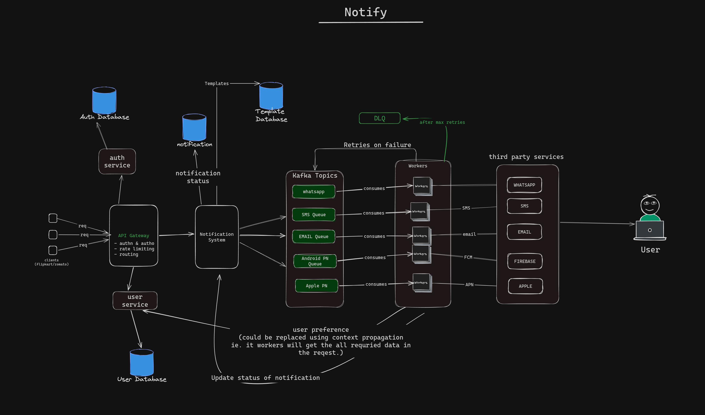
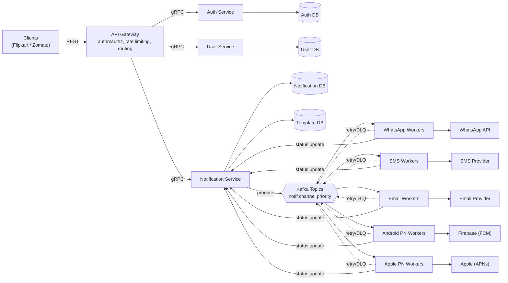

# Notify

A high-throughput, multi-channel notification platform built for e-commerce/delivery-scale traffic (SMS, WhatsApp, Email, Android Push, Apple Push) with reliable async delivery, per-channel retry/backoff, and dead-letter handling.



> **Status:** early-stage — core design finalized, service scaffolding in progress. Not production-ready yet.

---

## Table of contents

- [Overview](#overview)
- [Architecture](#architecture)
- [Tech stack](#tech-stack)
- [Repository structure](#repository-structure)
- [Getting started](#getting-started)
- [Configuration](#configuration)
- [API](#api)
- [Database](#database)
- [Kafka topic management](#kafka-topic-management)
- [Testing](#testing)
- [Roadmap](#roadmap)
- [Contributing](#contributing)
- [License](#license)

---

## Overview

Notify accepts notification requests over REST (via an API Gateway) and delivers them across five channels — WhatsApp, SMS, Email, Android Push (FCM), and Apple Push (APNs) — through a Kafka-backed async pipeline. Design priorities, in order:

- **Async-first**: notification creation returns immediately; delivery happens off the request path
- **Reliable delivery**: idempotency keys, per-channel retry with backoff, dead-letter queues for exhausted retries
- **Respect for user preference**: per-channel opt-in/opt-out resolved before fan-out
- **Horizontal scalability**: stateless services, partitioned Kafka topics, independently scalable worker pools per channel

## Architecture



Design docs with the full reasoning behind each layer:

- [`docs/architecture.md`](docs/architecture.md) — system design and improvement notes
- [`docs/database-schema.sql`](docs/database-schema.sql) — Postgres schema
- [`docs/api-design.md`](docs/api-design.md) — REST ↔ gRPC API design
- [`docs/kafka-topics.md`](docs/kafka-topics.md) — topic naming, partitioning, retry-tier strategy

## Tech stack

| Layer | Choice |
|---|---|
| Language | Go |
| Inter-service communication | gRPC (Protocol Buffers) |
| External API | REST (via API Gateway) |
| Messaging | Kafka |
| Database | PostgreSQL |
| Infra as code | Terraform (`Mongey/kafka` provider) |
| Architecture style | Domain-Driven Design + Hexagonal (Ports & Adapters) |

## Repository structure

Monorepo, one Go module per service, each following hexagonal architecture — domain logic has zero dependency on transport or infrastructure code.

```
notify/
├── services/
│   ├── notification-service/
│   │   ├── cmd/                    # entrypoint (main.go)
│   │   ├── internal/
│   │   │   ├── domain/             # entities, value objects, domain rules — no external deps
│   │   │   ├── application/        # use cases orchestrating domain logic (CreateNotification, etc.)
│   │   │   ├── ports/
│   │   │   │   ├── in/             # driving ports — interfaces adapters call INTO (e.g. NotificationService)
│   │   │   │   └── out/            # driven ports — interfaces application calls OUT to (e.g. NotificationRepository, EventPublisher)
│   │   │   └── adapters/
│   │   │       ├── grpc/           # driving adapter — gRPC server implementing ports/in
│   │   │       ├── postgres/       # driven adapter — implements ports/out repository interfaces
│   │   │       └── kafka/          # driven adapter — implements ports/out publisher interface
│   │   └── go.mod
│   ├── auth-service/                # same layout
│   ├── user-service/                # same layout
│   └── workers/
│       ├── sms-worker/
│       ├── email-worker/
│       ├── whatsapp-worker/
│       ├── android-pn-worker/
│       └── apple-pn-worker/
├── gateway/                          # API Gateway — REST-facing, gRPC-consuming
├── proto/                            # shared .proto contracts
│   ├── notification.proto
│   └── auth_and_user.proto
├── infra/
│   └── kafka/                        # Terraform: topic definitions
├── docs/
│   ├── architecture.md
│   ├── database-schema.sql
│   ├── api-design.md
│   └── kafka-topics.md
├── docker-compose.yml                 # local dev: Kafka, Postgres, all services
└── README.md
```

Each service's `domain` and `application` layers are pure Go with no gRPC, Kafka, or SQL imports — adapters are the only place infrastructure concerns live. This keeps business logic testable without spinning up Kafka/Postgres.

## Getting started

### Prerequisites

- Go 1.22+
- Docker & Docker Compose
- `protoc` + `protoc-gen-go` / `protoc-gen-go-grpc` (for regenerating gRPC code from `proto/`)
- Terraform 1.5+ (only needed for Kafka topic provisioning)

### Local setup

```bash
git clone https://github.com/<org>/notify.git
cd notify

# spin up Kafka, Postgres, and all services
docker-compose up -d

# apply DB schema
psql -h localhost -U notify -d notify -f docs/database-schema.sql

# provision Kafka topics
cd infra/kafka
terraform init
terraform apply

# regenerate gRPC code after editing any .proto file
cd ../../
./scripts/generate-proto.sh
```

### Running a single service

```bash
cd services/notification-service
go run cmd/main.go
```

## Configuration

Each service reads config from environment variables (see `.env.example` in each service directory). Common ones:

| Variable | Description |
|---|---|
| `KAFKA_BROKERS` | comma-separated broker addresses |
| `POSTGRES_DSN` | connection string for that service's DB |
| `GRPC_PORT` | port the service listens on |
| `LOG_LEVEL` | `debug` \| `info` \| `warn` \| `error` |

## API

- REST endpoints exposed by the Gateway are documented in [`docs/api-design.md`](docs/api-design.md)
- gRPC contracts live in [`proto/`](proto/) — source of truth for all inter-service calls

## Database

Schema, indexing, and design rationale (idempotency keys, hot/cold table separation, DLQ status modeling) are in [`docs/database-schema.sql`](docs/database-schema.sql).

## Kafka topic management

Topics are provisioned declaratively via Terraform, not manual scripts — see [`infra/kafka/`](infra/kafka/) and [`docs/kafka-topics.md`](docs/kafka-topics.md) for naming conventions (`notif.<channel>.<priority>`), partition sizing rationale, and the retry-tier/DLQ strategy.

## Testing

```bash
# unit tests (domain + application layers, no external deps)
go test ./services/.../internal/domain/... ./services/.../internal/application/...

# integration tests (requires docker-compose up)
go test -tags=integration ./...
```

## Roadmap

- [ ] Finalize managed vs. self-hosted Kafka decision
- [ ] CI/CD pipeline for Terraform across environments
- [ ] Delivery worker implementation per channel
- [ ] Provider integrations (Twilio, SES, FCM, APNs, WhatsApp Business API)
- [ ] Observability: consumer lag monitoring, distributed tracing, metrics dashboards
- [ ] Provider-side rate limiting & circuit breakers in workers

## Contributing

Contribution guidelines TBD. Issues and design discussion welcome in the meantime.

## License

TBD.